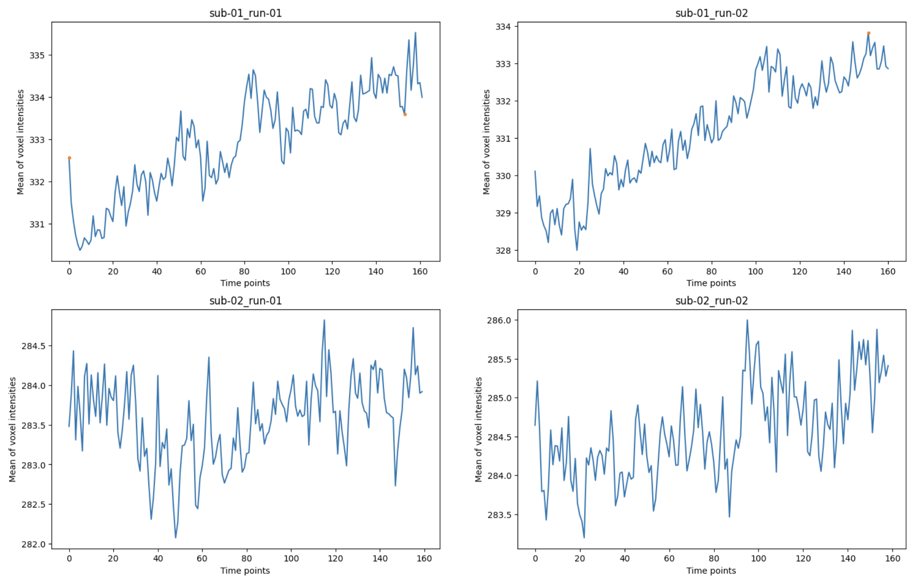
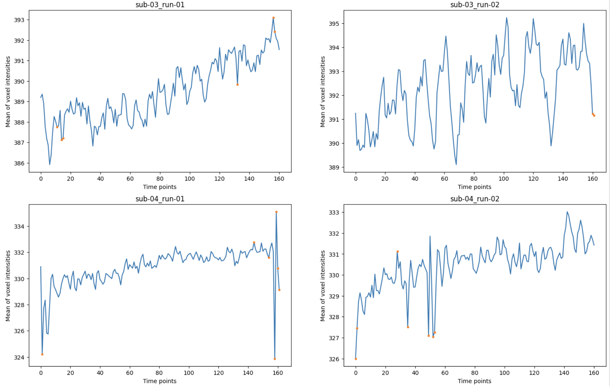
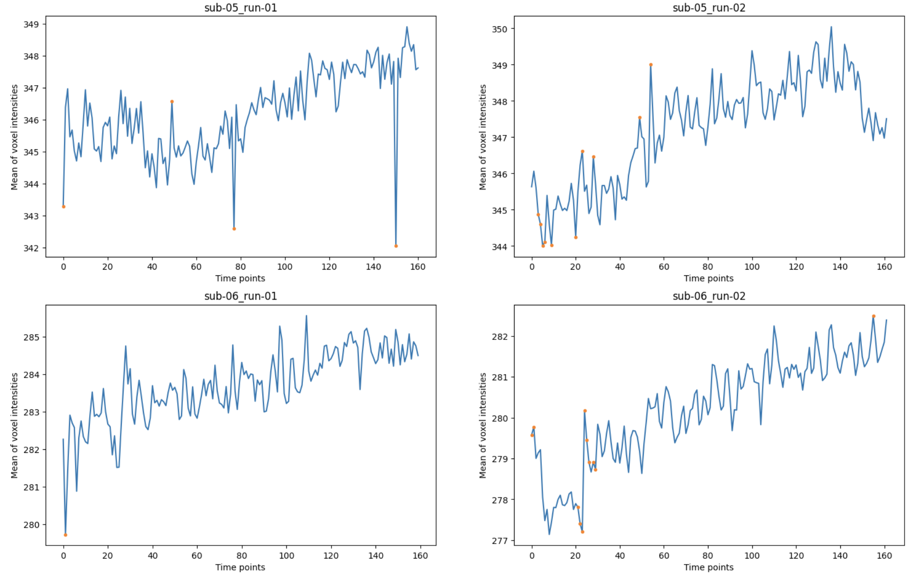
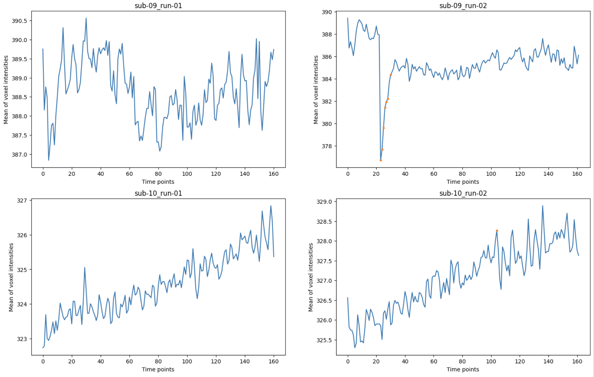

# Diagnostics project

Scripts go in the `scripts` directory.

Library code (Python modules) goes in the `findoutlie` directory.

You should put the code in this `findoutlie` directory on your Python PATH.

This README file has instructions on how to get, validate and process the data.

## clone the repository

```
git clone git@github.com:nipraxis-fall-2022/diagnostics-NME.git
```

## open the repository

```
cd diagnostics-NME
```

## Install the dependencies

Make sure to install everything listed in 'requirements.txt' using 'pip':
```
pip3 install --user scipy matplotlib pandas scikit-image sympy nibabel jupyter ipython jupytext nipraxis okpy
```
## Get the data

```
cd data
curl -L https://figshare.com/ndownloader/files/34951650 -o group_data.tar
tar xvf group_data.tar
```

First check if the hash_list.txt is added or not
```
git status
```

if there is no modification, it means the hash_list.txt is already added to git
Else, add the hash_list file to Git:

```
git add data/group-*/hash_list.txt
git commit -m "Add hash list file"
```

Change directory back to root of repository

```
cd ..
```

## Check the data

```
python3 scripts/validate_data.py data
```

## Install the new directory module 'findoutlie'

To do this, first install the Flit Python package manager:
Flit is a system for configuring and installing modules.
You may be able to moit the --user below
```
python3 -m pip install --user flit
```

Next install the module using Flit. Here the command differs on Windows compared  to Linux or macOS.

For macOS and Linux:

(See below for Windows command)
Use Flit to install the module.

```
python3 -m flit install --user -s
```

For Windows:
(See above for macOS and Linux)
Use Flit to install the module.

```
python3 -m flit install --user --pth-file
```

Now test that you can import the 'findoutlie' module by running the command. The -c flag tells Python to run the code that follows the -c flag.

```
python3 -c 'import findoutlie'
```

This should give no error, because the previous step installed the 'findoutlie' directory module to somewhere on Python's search path. 

## Find outliers

```
python3 scripts/find_outliers.py data
```

This should print output to the terminal of form:

```
<filename>, <outlier_index>, <outlier_index>, ...
<filename>, <outlier_index>, <outlier_index>, ...
```

Where `<filename>` is the name of the image that has outlier scans, and
`<outlier_index>` is an index to the volume in the 4D image that you have
identified as an outlier.  0 refers to the first volume.  For example (these
outlier IDs are completely random, for illustration):

```
data/group-01/sub-08/func/sub-08_task-taskzero_run-01_bold.nii.gz, 11, 157
data/group-01/sub-08/func/sub-08_task-taskzero_run-02_bold.nii.gz, 79, 153
data/group-01/sub-01/func/sub-01_task-taskzero_run-01_bold.nii.gz, 0, 153
data/group-01/sub-01/func/sub-01_task-taskzero_run-02_bold.nii.gz, 151
data/group-01/sub-06/func/sub-06_task-taskzero_run-02_bold.nii.gz, 0, 1, 21, 22, 23, 24, 25, 26, 28, 29, 155
data/group-01/sub-06/func/sub-06_task-taskzero_run-01_bold.nii.gz, 1
data/group-01/sub-07/func/sub-07_task-taskzero_run-02_bold.nii.gz, 79, 80
data/group-01/sub-07/func/sub-07_task-taskzero_run-01_bold.nii.gz, 85
data/group-01/sub-09/func/sub-09_task-taskzero_run-02_bold.nii.gz, 23, 24, 25, 26, 27, 28, 30
data/group-01/sub-10/func/sub-10_task-taskzero_run-02_bold.nii.gz, 104
data/group-01/sub-05/func/sub-05_task-taskzero_run-01_bold.nii.gz, 0, 49, 77, 150
data/group-01/sub-05/func/sub-05_task-taskzero_run-02_bold.nii.gz, 3, 4, 5, 6, 9, 20, 23, 28, 49, 54
data/group-01/sub-03/func/sub-03_task-taskzero_run-02_bold.nii.gz, 160, 161
data/group-01/sub-03/func/sub-03_task-taskzero_run-01_bold.nii.gz, 11, 14, 15, 132, 156, 157
data/group-01/sub-04/func/sub-04_task-taskzero_run-01_bold.nii.gz, 1, 144, 154, 158, 159, 160, 161
data/group-01/sub-04/func/sub-04_task-taskzero_run-02_bold.nii.gz, 0, 1, 28, 35, 49, 52, 53
```

Shown below are the plots of the mean of voxel intensities for each time point vs time points. The detected outliers are marked in orange colour:






